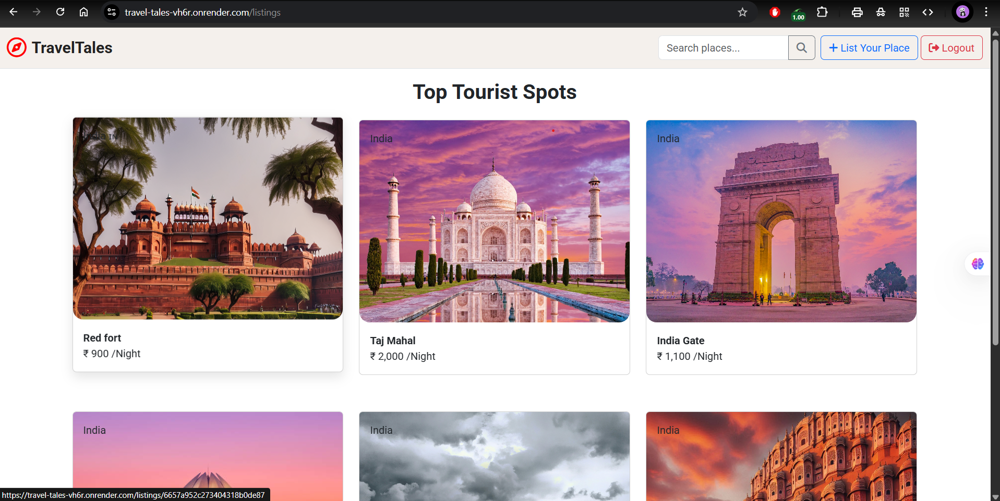

# Travel-Tales 🌍✨

A full-stack **travel listing platform** where users can **list, edit, explore, and review travel destinations** to help travelers discover and plan their adventures easily.

---

## 🚀 Live Demo

👉 [Visit Travel-Tales on Render](https://travel-tales-vh6r.onrender.com/)



---

## 🛠️ Features

✅ User authentication (register, login, logout)  
✅ Add, edit, delete travel listings with images  
✅ Map integration with **Mapbox** to show locations  
✅ Leave reviews and ratings on listings  
✅ Responsive, clean UI with **Bootstrap**  
✅ Flash messages for feedback

---

## ⚙️ Tech Stack

- **Frontend**: EJS, Bootstrap, JavaScript
- **Backend**: Node.js, Express.js
- **Database**: MongoDB with Mongoose
- **Map Integration**: Mapbox
- **Authentication**: Passport.js
- **Deployment**: Render

---

## 🖥️ Installation & Run Locally

1️⃣ **Clone the repository:**

```bash
git clone https://github.com/Anurag888000/Travel-Tales.git
cd Travel-Tales
